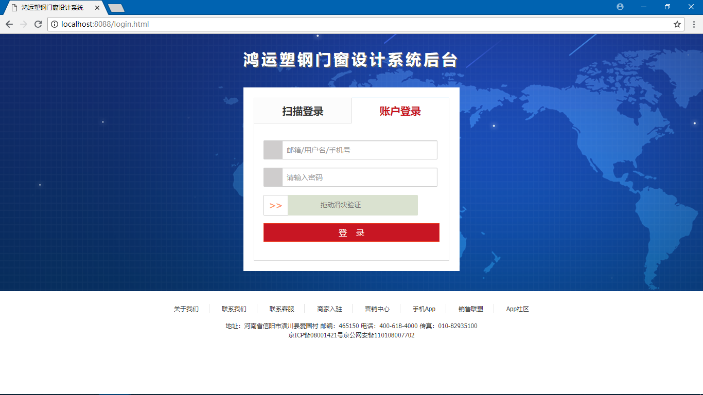
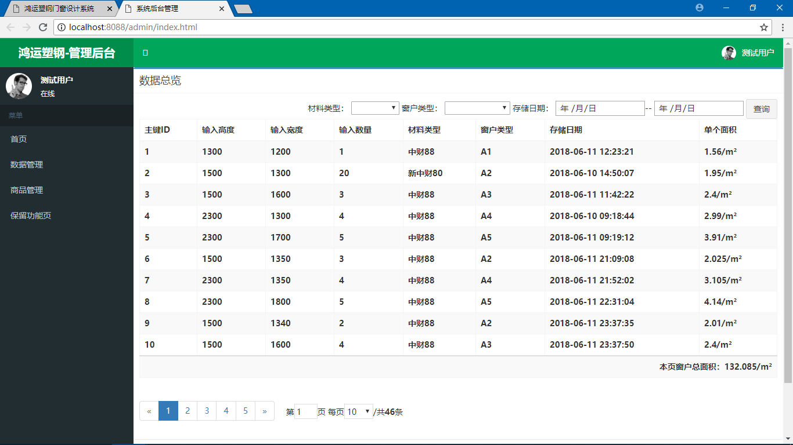
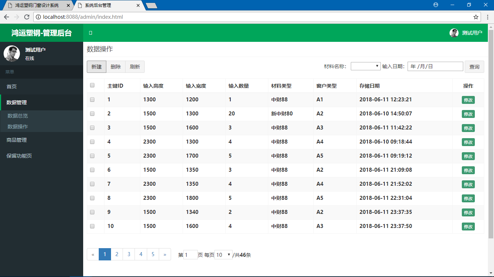
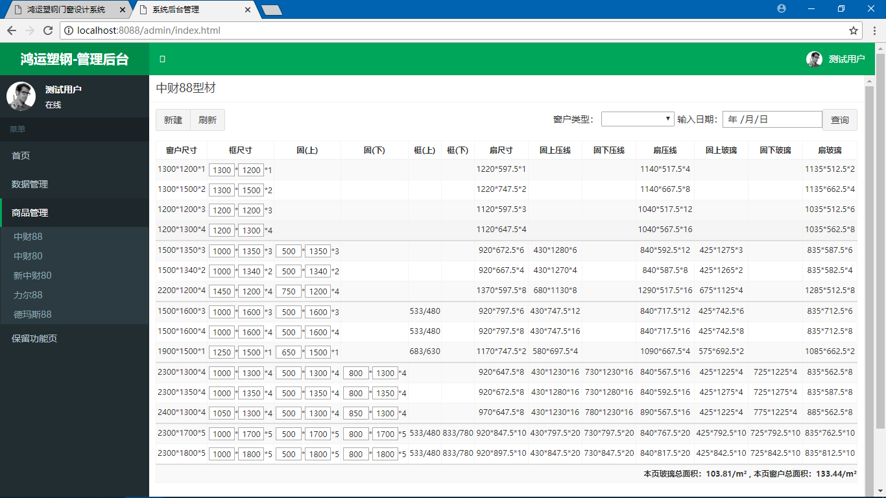
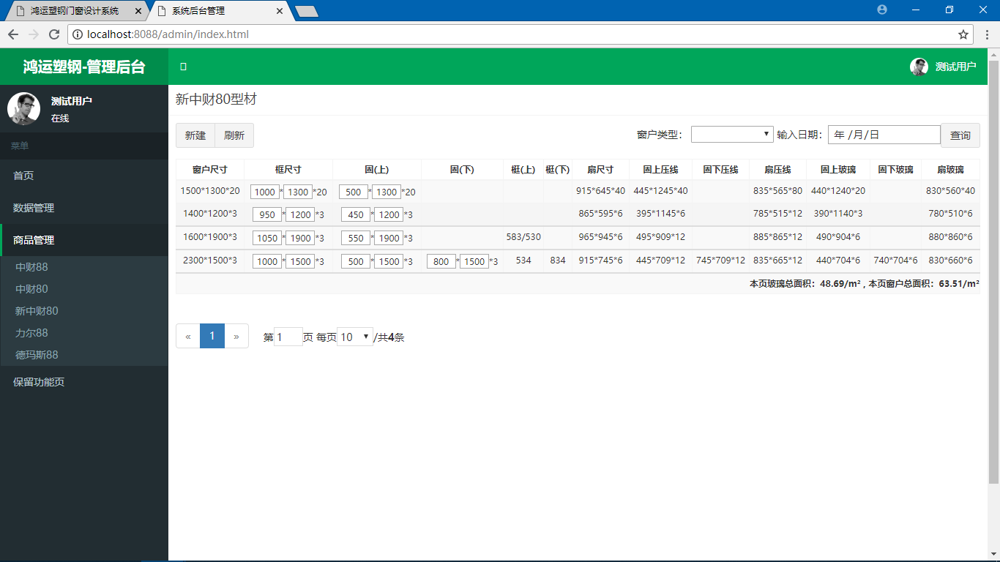

# WindowDesign
SSM + AngularJS整合后的一个窗户设计系统

## 启动

- git clone https://github.com/0saber0/WindowDesign
- 创建数据库：window
- 创建表：windowdata
- 导入数据脚本：window.sql
- 重启运行 mvn tomcat7:run
- 访问 http://localhost:8088/window/login.html
- 用户名: 无 密码: 无

## 技术栈

- spring
- springmvc
- mybatis
- AngularJS
- mysql

## 截图

